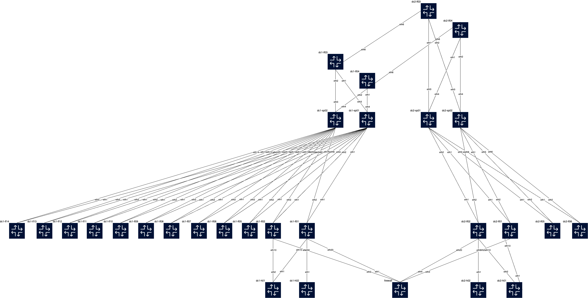

# AVD based DC & DCI EVPN-VxLAN AA (ESI)

This lab is tested for:  

  cEOS-lab version: 4.31.4M
  Containerlab Version: 0.69.1  
  Codespace Container Size  
    vCPUs: 16-24  
    memory: 32 GB  
    storage: 128 GB  

Last reviewed: 18/06/2024  

Enjoy!
