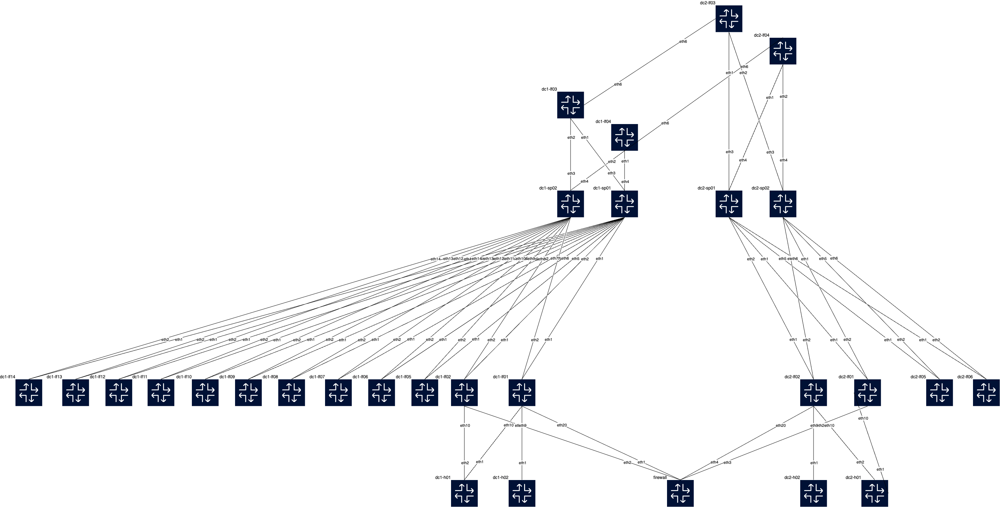

# AVD based DC & DCI EVPN-VxLAN AA (ESI)

This lab is tested for:  

  cEOS-lab version: 4.31.4M
  Containerlab Version: 0.69.1  
  Codespace Container Size  
    vCPUs: 16-24  
    memory: 32-64 GB  
    storage: 64-128 GB  

Last reviewed: 1/08/2025 

Enjoy! ;)
